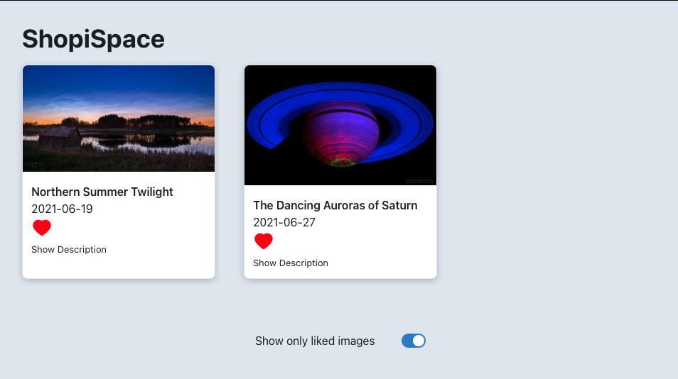
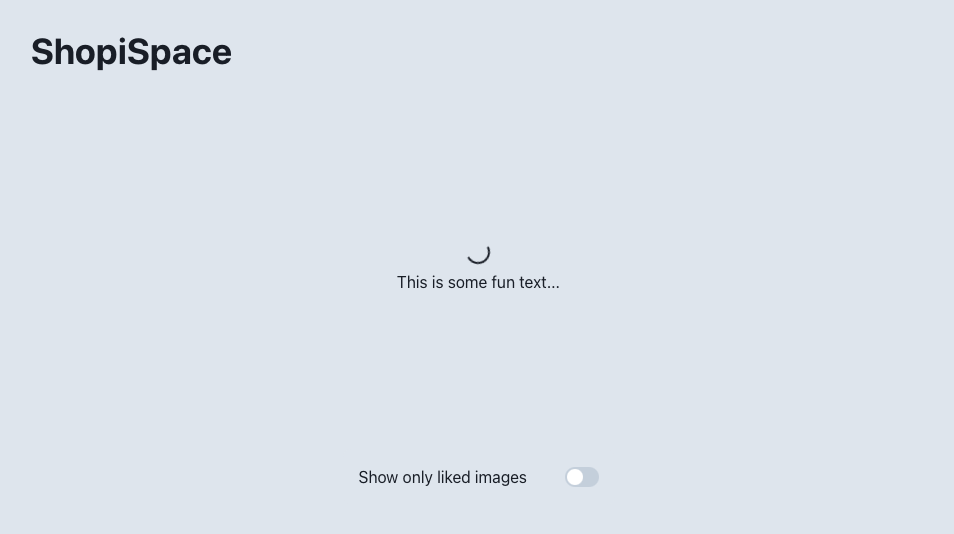

# Shopify Challenge 2021/2022

This repo contains my submission for the Spacetagram Shopify take home challenge. 

## Key Features

1. User's liked images are saved if the user leaves or reloads the page
2. Display only liked images toggle
3. Loading state while waiting for NASA API to return data
4. Load more button (also with loading state)
5. Animation on card load in

## Implementations

This section goes over the implementation of some key features at a high level.

### (1) Saved Likes

Saved likes are accomplished using the IndexedDB functionality that is built into modern browsers. When a user likes an image, the image json is saved to the IndexedDb, using the image title as the PK.

When cards are loaded, the app checks to see if that card's image's name is in the IndexedDb. If the image title is found, the image is given a "liked" state.

### (2) Display only Liked Images

The user can decide whether or not they would like to show only their liked images by using the slider at the bottom of the screen. Using the slider toggles the ```showOnlyLiked``` state. This state is passed down to the ```<ImageCard/>``` component via the top level ```AppContext```. Based on the ```showOnlyLiked``` state, ```<ImageCard/>``` decides the value of it's display property. 



### (3) Loading State 

On the initial render, the ```imagesLoaded``` state is set to false. When the app is in this state, a loading spinner is shown. 

The NASA API is called via fetch. Once the fetch promise is resolved, the ```imagesLoaded``` state is set to true, and the image cards are displayed. 

